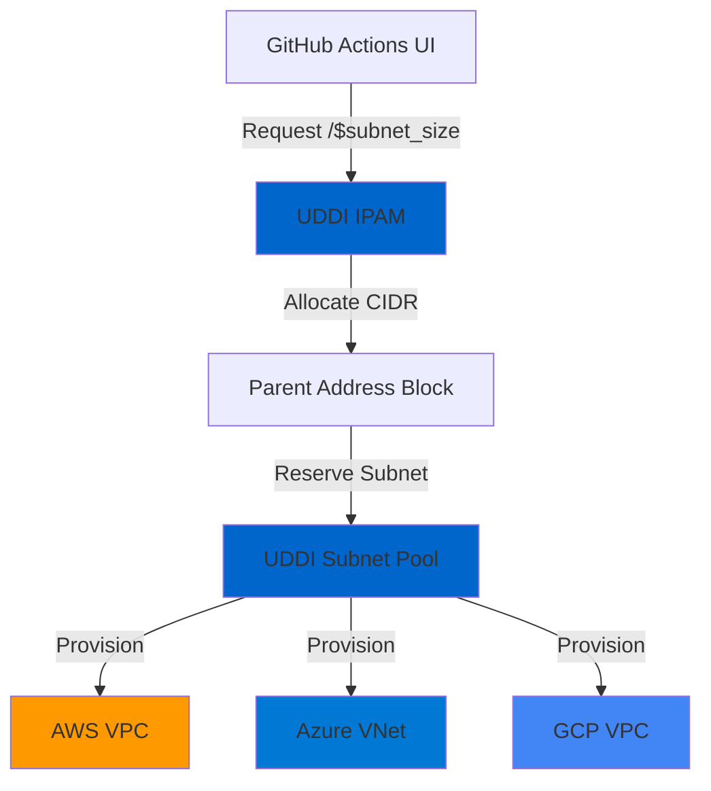

# Multi-Cloud VPC/VNet Provisioning Demo

## Overview

This demo showcases **Infoblox Universal DDI** as the centralized IPAM platform for multi-cloud network provisioning across AWS, Azure, and GCP.

## Architecture

## Key Features

✅ **Single IPAM Source of Truth** - UDDI centrally manages all cloud network CIDRs  
✅ **Multi-Cloud Support** - Deploy to 1, 2, or all 3 cloud providers in one action  
✅ **Conflict Prevention** - UDDI ensures no overlapping IP ranges  
✅ **Zero-Touch Automation** - No manual CIDR planning required  
✅ **Audit Trail** - All allocations tagged and tracked in UDDI  

## How to Run

### GitHub Actions UI

1. Go to **Actions** → **Multi-Cloud VPC/VNet Provisioning**
2. Click **Run workflow**
3. Configure parameters:
   - **Network Name**: Base name for VPC/VNet (e.g., `demo-vpc`)
   - **Parent IPAM Block**: CIDR block to allocate from (e.g., `10.0.0.0/8`)
   - **Subnet Size**: Size of subnet to allocate (e.g., `/24`)
   - **☑️ Deploy to AWS**: Check to deploy AWS VPC
   - **AWS Region**: Select AWS region (if enabled)
   - **☑️ Deploy to Azure**: Check to deploy Azure VNet
   - **Azure Location**: Select Azure location (if enabled)
   - **☑️ Deploy to GCP**: Check to deploy GCP VPC
   - **GCP Region**: Select GCP region (if enabled)
   - **Action**: `apply` (create) or `destroy` (delete)

4. Click **Run workflow**

### Example Scenarios

#### Single Cloud (AWS Only)
- ☑️ Deploy to AWS: `true`
- ☐ Deploy to Azure: `false`
- ☐ Deploy to GCP: `false`

#### Two Clouds (AWS + Azure)
- ☑️ Deploy to AWS: `true`
- ☑️ Deploy to Azure: `true`
- ☐ Deploy to GCP: `false`

#### All Three Clouds
- ☑️ Deploy to AWS: `true`
- ☑️ Deploy to Azure: `true`
- ☑️ Deploy to GCP: `true`

## Workflow Details

### 1. **Preflight Check**
- Validates at least one cloud provider is selected
- Fails fast if no providers checked

### 2. **Parallel Provisioning** (per cloud)
Each selected cloud runs in parallel:
- Query UDDI IPAM for next available subnet from parent block
- Reserve subnet in UDDI with `demo=true` tag
- Provision VPC/VNet in cloud provider with UDDI-allocated CIDR
- Verify deployment via cloud provider API
- Output results (VPC ID, CIDR, region/location)

### 3. **Job Summary**
- Multi-cloud architecture diagram (dynamic based on selections)
- Configuration table
- Provisioning results per cloud
- Business value proposition

## Terraform Structure

### AWS VPC (`live/vpc-demo-aws/`)
- **Provider**: AWS (~> 5.0)
- **Resources**:
  - `bloxone_ipam_subnet` - Reserve subnet in UDDI
  - `aws_vpc` - VPC with UDDI-allocated CIDR
  - `aws_internet_gateway` - Internet gateway

### Azure VNet (`live/vpc-demo-azure/`)
- **Provider**: AzureRM (~> 3.0)
- **Resources**:
  - `bloxone_ipam_subnet` - Reserve subnet in UDDI
  - `azurerm_resource_group` - Resource group
  - `azurerm_virtual_network` - VNet with UDDI-allocated CIDR

### GCP VPC (`live/vpc-demo-gcp/`)
- **Provider**: Google (~> 5.0)
- **Resources**:
  - `bloxone_ipam_subnet` - Reserve subnet in UDDI
  - `google_compute_network` - VPC network
  - `google_compute_subnetwork` - Subnet with UDDI-allocated CIDR

## Cleanup

### Automated Daily Cleanup
- Scheduled daily at **00:00 GMT+2 (22:00 UTC)**
- Discovers all UDDI subnets with `demo=true` tag
- Destroys cloud resources via Terraform
- Releases UDDI subnets back to parent block

### Manual Cleanup
1. Go to **Actions** → **Automated Cleanup**
2. Click **Run workflow**
3. Type `destroy` to confirm
4. Click **Run workflow**

## Prerequisites

### Secrets Required

#### GitHub Environment: `dev`
- `BLOXONE_API_KEY` - Infoblox UDDI API key
- `BLOXONE_HOST` (variable) - UDDI CSP URL (e.g., `https://csp.infoblox.com`)

#### AWS (if deploying to AWS)
- `AWS_ACCESS_KEY_ID` - AWS access key
- `AWS_SECRET_ACCESS_KEY` - AWS secret key

#### Azure (if deploying to Azure)
- `ARM_CLIENT_ID` - Azure service principal client ID
- `ARM_CLIENT_SECRET` - Azure service principal secret
- `ARM_SUBSCRIPTION_ID` - Azure subscription ID
- `ARM_TENANT_ID` - Azure tenant ID

#### GCP (if deploying to GCP)
- `GCP_CREDENTIALS` - GCP service account JSON key
- `GCP_PROJECT_ID` - GCP project ID

## UDDI IPAM Setup

### Required Parent Address Block
1. Log in to Infoblox CSP
2. Navigate to **IPAM** → **Address Blocks**
3. Create parent block (e.g., `10.0.0.0/8`)
4. Ensure IPAM space is configured

### Subnet Allocation
- UDDI automatically allocates next available subnet from parent block
- Allocation size determined by workflow input (e.g., `/24`)
- Each cloud gets a unique, non-overlapping CIDR

## Business Value

### Single Source of Truth
- **Before**: Spreadsheets, manual tracking, overlapping IP ranges
- **After**: UDDI centrally manages all cloud networks

### Zero-Touch Automation
- **Before**: Manual CIDR planning, cloud console clicks, human errors
- **After**: Click button, UDDI + Terraform handle everything

### Multi-Cloud Consistency
- **Before**: Different IPAM tools per cloud, no unified view
- **After**: One IPAM platform for AWS, Azure, GCP, on-prem

### Audit & Compliance
- **Before**: No audit trail, unknown allocations
- **After**: All allocations tagged, tracked, reportable

## Troubleshooting

### "No cloud provider selected" error
- At least one cloud checkbox must be checked
- Preflight check enforces this validation

### Terraform state conflicts
- Each cloud uses separate state cache
- Cache key includes network name + region/location
- Safe to run multiple demos simultaneously

### Cloud credentials missing
- Ensure all required secrets configured in GitHub Environment `dev`
- Workflow only requires secrets for selected clouds

### UDDI subnet allocation fails
- Verify parent block exists in UDDI IPAM
- Check parent block has available space
- Confirm API key has IPAM permissions

## Next Steps

### Demo Extensions
1. Add VPC peering between clouds
2. Implement transit gateway/hub-spoke topology
3. Add DHCP ranges within allocated subnets
4. Integrate with DNS automation (A records for VPC endpoints)
5. Multi-region deployment per cloud

### Production Considerations
- Use remote Terraform state (S3/Azure Blob/GCS)
- Implement approval gates for apply
- Add cost estimation (Infracost)
- Enable drift detection
- Integrate with existing CI/CD pipelines

---

**Powered by Infoblox Universal DDI** | Multi-Cloud IPAM | Terraform | GitHub Actions
